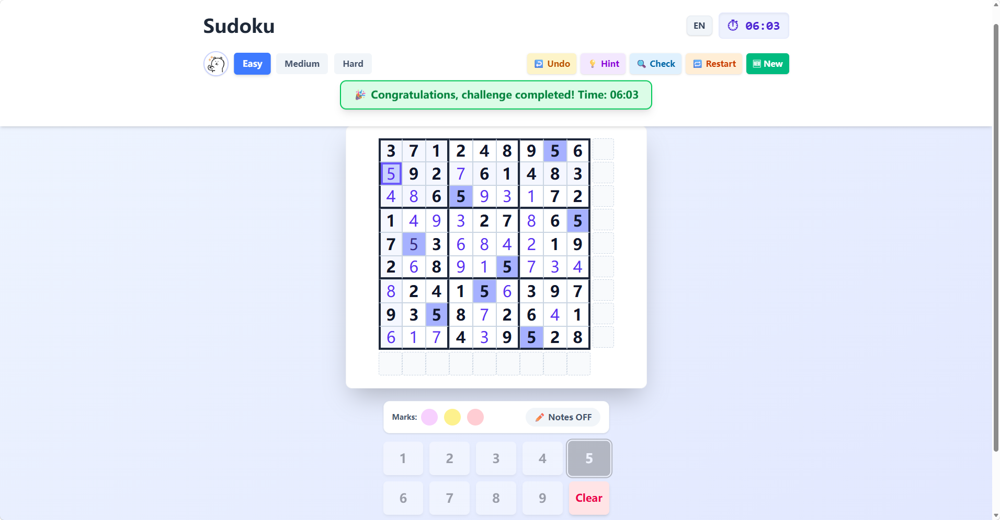
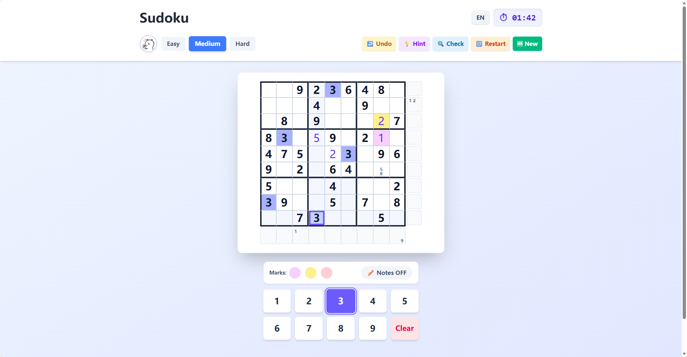
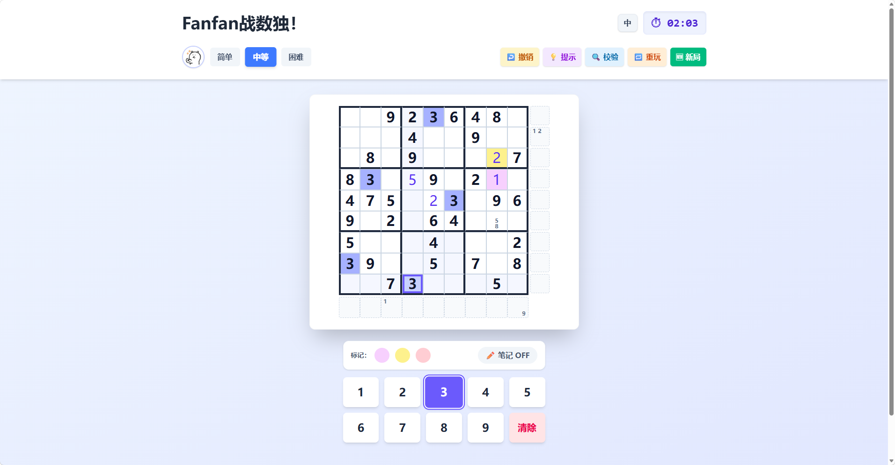
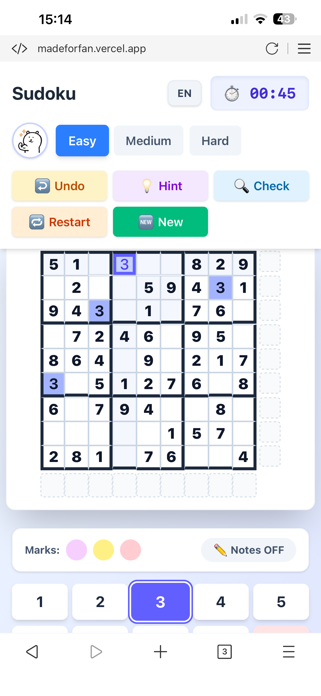

# Yorick Sudoku 🧩


> A high-performance, algorithm-driven Sudoku web application with a custom puzzle generator and advanced note-taking system.

🌐 **Live Demo:** [madeforfan.vercel.app](https://madeforfan.vercel.app)

## 📖 The Story Behind the Project

This project was born out of a real-world user pain point. My partner is an avid Sudoku player, but we found that most mobile Sudoku apps on the market share the same frustrating flaws:
- Intrusive ads disrupting the state of flow.
- "Life" limits or paywalls that penalize mistakes.
- Clunky and restrictive note-taking mechanics.

I built this project to provide a pure, uninterrupted, and highly customizable puzzle-solving experience. It serves as a testament to how tailored software engineering can solve everyday frustrations.

## 🚀 Key Features

### 🎮 Core Gameplay & Controls
- **Smart Difficulty Levels:** Easy, Medium, and Hard.
- **Full Game Controls:** Undo, Clear, Hint, Check progress, Restart current board, or Start a completely new game.
- **Zero Paywalls & No Ads:** Just pure logic and problem-solving.

### 📝 Advanced Note-Taking System
Designed specifically for hardcore Sudoku players:
- **3x3 In-Cell Notes:** Accurately visualizes candidate numbers within a single cell.
- **Edge Drafting:** Supports writing row/column drafts outside the main grid for cross-referencing.
- **Color Highlighting:** Allows users to mark specific cells with custom background colors (Pink, Yellow, Red) for visual grouping and advanced strategies (like X-Wing or coloring techniques).

### 🛠 Engineering & UX
- **Custom i18n Architecture:** Lightweight, Context-based internationalization supporting seamless switching between English and Chinese.
- **State Persistence:** Uses `LocalStorage` to save the game state in real-time. You can close the browser and resume exactly where you left off.
- **Responsive Design:** Fully optimized for both desktop and mobile touch screens using Tailwind CSS.

---


## 📸 Screenshots

### 💻 Desktop View
<p align="center">
  
  
</p>
<p align="center">
  
</p>

### 📱 Mobile View
<p align="center">
  
</p>

---

## 🧠 Core Algorithm: The Puzzle Generator

Unlike basic Sudoku apps that randomly remove numbers (often leading to frustrating puzzles with multiple valid solutions), this project features an **Industrial-grade Puzzle Generator**.

1. **Perfect Board Generation:**
   Utilizes a Depth-First Search backtracking algorithm to generate a complete, valid 81-cell Sudoku board.
2. **Hole-Digging & Unique Solution Validation:**
   The algorithm selectively removes numbers based on the chosen difficulty. After *every single removal*, the engine runs a highly optimized backtracking solver against the remaining board.
    - If the solver detects more than one valid solution, the algorithm backtracks, restores the number, and digs elsewhere.
    - Result: Every puzzle generated is guaranteed to have **one and only one absolute solution**, entirely eliminating the "Deadly Pattern" ambiguity and ensuring a flawless user experience.

## 💻 Tech Stack

- **Framework:** React 18 (Custom Hooks, Context API)
- **Build Tool:** Vite
- **Styling:** Tailwind CSS
- **Deployment & Analytics:** Vercel

## ⚙️ Local Setup

To run this project locally, follow these steps:

```bash
# 1. Clone the repository
git clone https://github.com/PinocchioHao/yorick-sudoku.git

# 2. Navigate to the project directory
cd yorick-sudoku

# 3. Install dependencies
npm install

# 4. Start the development server
npm run dev